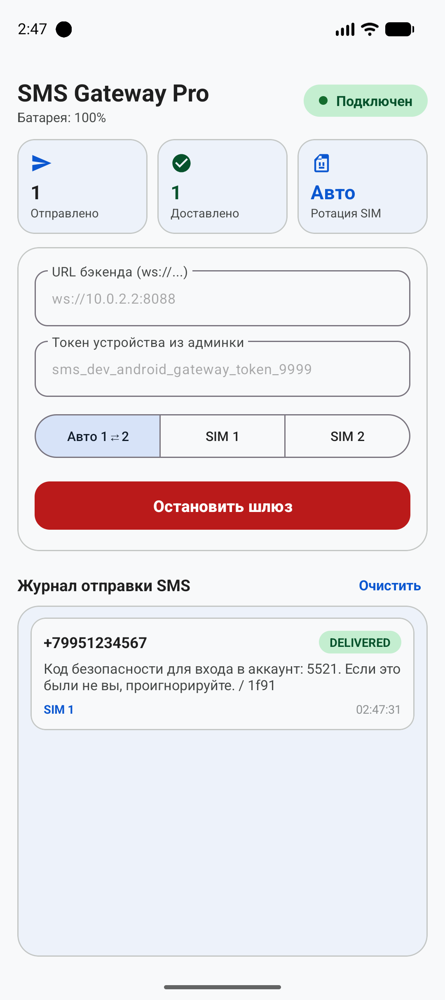
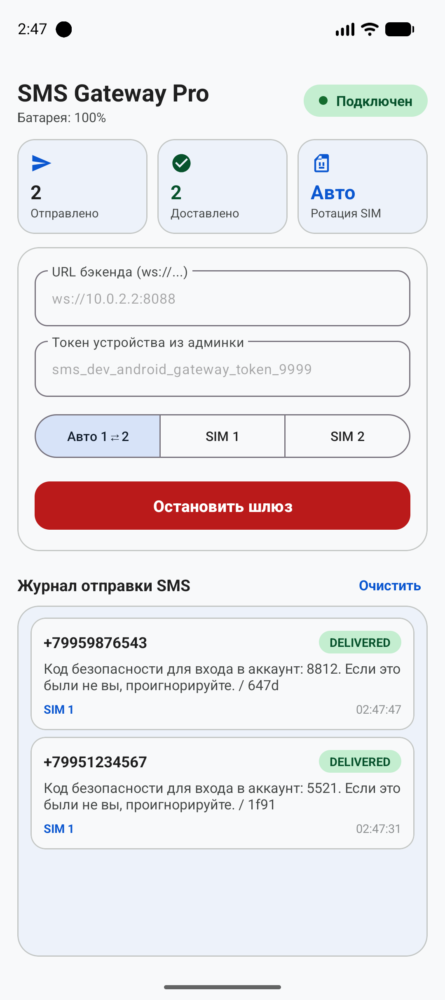

# SMS Gateway Android App (GSM Gateway)

Нативный Android GSM-шлюз на **Kotlin** с современным интерфейсом по гайдлайнам **Google Material Design 3 (Material You)**, поддержкой старых версий Android (от **Android 9 Pie / API 28** до **Android 14 / API 34**), автоматической ротацией SIM-карт и защитой от выгрузки системой 24/7.

🌐 **Backend API & Server**: [https://github.com/yusuff84/sms-gateway](https://github.com/yusuff84/sms-gateway)

---

## 📱 Скриншоты приложения

| Material 3 Главный экран | Ротация SIM и доставка |
|:---:|:---:|
|  |  |

---

## 🛡 Возможности и живучесть 24/7 (Zero-Downtime)

1. **Дизайн Google Material Design 3 (Material You)**:
   - Статус-пилюля соединения со скруглением 100dp и световой индикацией.
   - Тональные карточки метрик: «Отправлено», «Доставлено», «SIM Ротация».
   - Сегментированный переключатель режимов: `[ Авто 1⇄2 ]` | `[ SIM 1 ]` | `[ SIM 2 ]`.
   - Журнал сообщений в реальном времени с цветными бейджами статусов доставки.

2. **Поддержка Android 9 Pie (API 28) и новее**:
   - Полная обратная совместимость системных вызовов (`startForeground`, `PendingIntent`, `BroadcastReceiver`).

3. **Многоуровневая защита от выгрузки системой**:
   - `Foreground Service` с постоянным системным уведомлением.
   - `PARTIAL_WAKE_LOCK`: процессор не уходит в глубокий сон при выключенном экране.
   - `WorkManager Watchdog`: каждые 15 минут проверяет состояние службы и автоматически воскрешает её, если система завершила процесс из-за нехватки RAM.
   - `ConnectivityManager.NetworkCallback`: мгновенное восстановление WebSocket-соединения при переключении Wi-Fi ↔ LTE без ожидания TCP-таймаута.
   - `BootReceiver`: автоматический запуск после перезагрузки телефона.

4. **Атомарный Multipart SMS Tracker**:
   - Поддержка длинных сообщений (составные SMS > 70 символов на кириллице).
   - Статус `SENT` рапортуется на бэкенд только когда все части подтверждены сотовой вышкой.
   - Статус `DELIVERED` рапортуется только после доставки всех частей получателю.

5. **Авто-ротация Dual-SIM**:
   - Возможность работы в режиме попеременной отправки `SIM 1 ⇄ SIM 2` для защиты от лимитов сотовых операторов.

6. **Телеметрия питания**:
   - Каждые 20–25 секунд шлет Heartbeat с процентом заряда батареи и статусом зарядки.

---

## ⚠️ Критическая боевая настройка Android: Снятие лимита SMS

В Android по умолчанию действует системный лимит — **не более 30 SMS за 30 минут**. При превышении система блокирует отправку и запрашивает ручное подтверждение.

Чтобы снять этот лимит навсегда, подключите телефон к ПК по USB с отладкой и выполните **один раз**:

```bash
# Установить лимит в 99999 сообщений
adb shell settings put global sms_outgoing_check_max_count 99999

# Отключить интервал проверки лимита
adb shell settings put global sms_outgoing_check_interval_ms 0
```

### Настройка телефона для работы 24/7:
1. **Батарея**: В настройках приложения выберите режим контроля активности: **«Без ограничений»** (Unrestricted).
2. **Автозапуск**: Разрешите «Автозапуск» (для Xiaomi MIUI/HyperOS, Huawei EMUI, Samsung OneUI).
3. **Закрепление**: В меню запущенных приложений повесьте замочек на карточку SMS Gateway.
4. **Питание**: Оставьте телефон подключенным к штатному зарядному устройству.

---

## 🛠 Сборка проекта

### Сборка релизного APK через Gradle:
```bash
./gradlew assembleRelease
```
Файл APK будет доступен по пути:
`app/build/outputs/apk/release/app-release.apk`

### Установка на телефон:
```bash
adb install -r app/build/outputs/apk/release/app-release.apk
```
